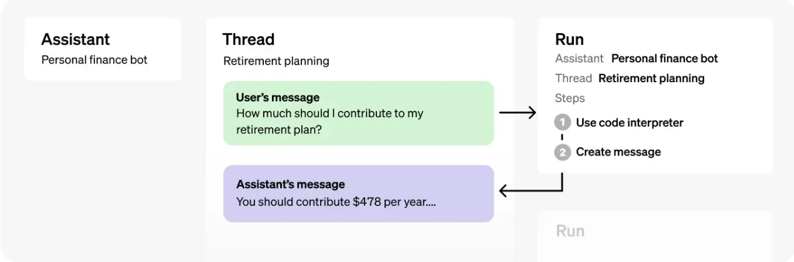

Assistants API Overview

Assistants API를 활용해서 AI 어시스트를 appllication에 넣을 수 있음.
three types of tools: Code Interpreter, File Search, Function calling

### How Assistants Work

주요 기능으로는 스레드기반 상태 관리 포함 -> 무한히 긴 대화도 처리 가능

* 1단계 : 보조자(Assistant) 만들기
보조자는 사용자의 메세지에 대응하여 여러 매개변수를 사용해 응담할 수 있는 엔티티를 나타냄

* 2단계 : 스레드(Thread) 생성하기
스레드는 대화를 나타냅니다.